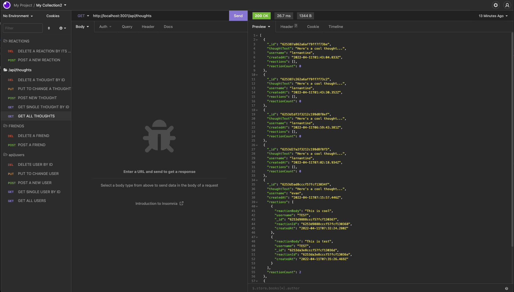
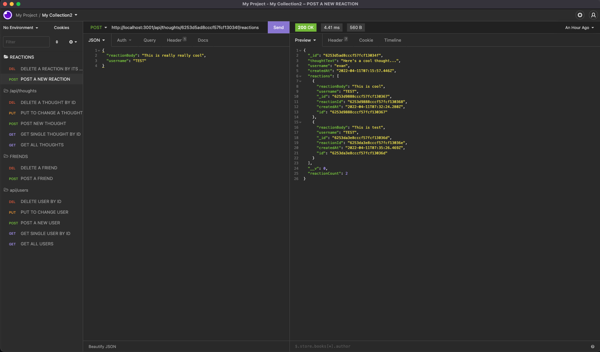

# Social-Network-API

## License

[](https://opensource.org/licenses/MIT)

https://opensource.org/licenses/MIT


## Table of Contents
* [Description](#description) 
* [Technologies](#technologies)
* [Installation Instructions](#installation)
* [Usage Instructions](#usage)
* [Contribution Guide](#contribute)
* [Tests](#tests)
* [Questions](#questions)


## Description
This project is designed to emulate a social media api that allows a user to have friends, comments and reactions to comments. The application allows users to perform CRUD operations on the database.

The application shows responses on get requests as follows:


The application also sends the updated or added fields as a response to PUT or POST requests.



## Technologies
* Express js
* Node js
* Mongo MongoDB
* Mongoose


## Installation
To Install and run this application yourself, follow the below step(s).

```
npm i
```
Followed by:
```
npm start
```


## Usage
Once installed and running using hte above commands, interact with the database in a tool like Insomnia.


## Contribute
This project is finished and requires no additional contributions


## Tests
This project does not include tests


## Questions
For any questions about the code please see my github for source code, email me at the address provided, or find my social media links on my portfolio website. 
* https://github.com/
* evan.woods.dev@gmail.com
* https://evan-woods-updated-portfolio.herokuapp.com/

External Resources and References:
* "Mongoose Cheatcheet":
https://gist.github.com/tmurphree/1a6a8f575b7309c478fac406f0e893b2